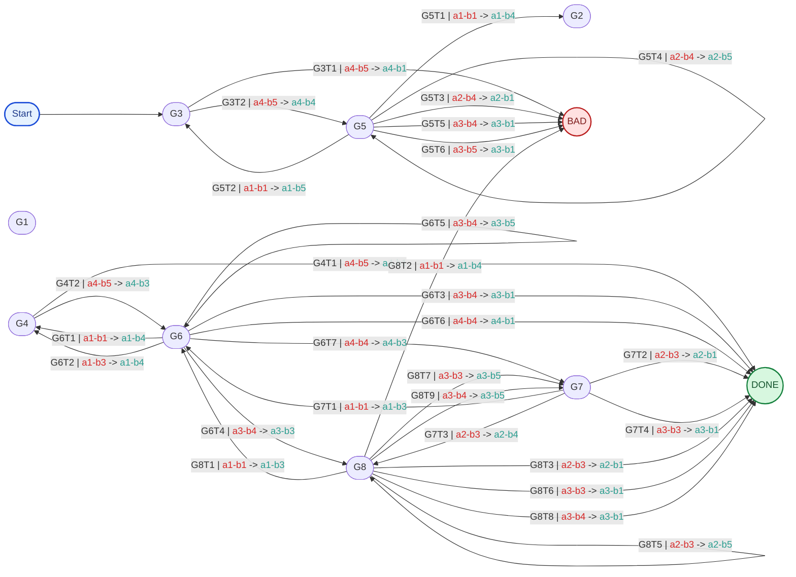

# Critical-Transition Automata

- Start state: `G3`
- Final state: `DONE`
- Bad state: `BAD`

```mermaid
flowchart LR
  START([Start]) --> G3
  G1([G1])
  G2([G2])
  G3([G3])
  G4([G4])
  G5([G5])
  G6([G6])
  G7([G7])
  G8([G8])
  DONE((DONE))
  BAD((BAD))

  G3 -- "G3T1 | <span style="color:#d62828">a4-b5</span> -> <span style="color:#2a9d8f">a4-b1</span>" --> BAD
  G3 -- "G3T2 | <span style="color:#d62828">a4-b5</span> -> <span style="color:#2a9d8f">a4-b4</span>" --> G5
  G4 -- "G4T1 | <span style="color:#d62828">a4-b5</span> -> <span style="color:#2a9d8f">a4-b1</span>" --> DONE
  G4 -- "G4T2 | <span style="color:#d62828">a4-b5</span> -> <span style="color:#2a9d8f">a4-b3</span>" --> G6
  G5 -- "G5T1 | <span style="color:#d62828">a1-b1</span> -> <span style="color:#2a9d8f">a1-b4</span>" --> G2
  G5 -- "G5T2 | <span style="color:#d62828">a1-b1</span> -> <span style="color:#2a9d8f">a1-b5</span>" --> G3
  G5 -- "G5T3 | <span style="color:#d62828">a2-b4</span> -> <span style="color:#2a9d8f">a2-b1</span>" --> BAD
  G5 -- "G5T4 | <span style="color:#d62828">a2-b4</span> -> <span style="color:#2a9d8f">a2-b5</span>" --> G5
  G5 -- "G5T5 | <span style="color:#d62828">a3-b4</span> -> <span style="color:#2a9d8f">a3-b1</span>" --> BAD
  G5 -- "G5T6 | <span style="color:#d62828">a3-b5</span> -> <span style="color:#2a9d8f">a3-b1</span>" --> BAD
  G6 -- "G6T1 | <span style="color:#d62828">a1-b1</span> -> <span style="color:#2a9d8f">a1-b4</span>" --> G4
  G6 -- "G6T2 | <span style="color:#d62828">a1-b3</span> -> <span style="color:#2a9d8f">a1-b4</span>" --> G4
  G6 -- "G6T3 | <span style="color:#d62828">a3-b4</span> -> <span style="color:#2a9d8f">a3-b1</span>" --> DONE
  G6 -- "G6T4 | <span style="color:#d62828">a3-b4</span> -> <span style="color:#2a9d8f">a3-b3</span>" --> G8
  G6 -- "G6T5 | <span style="color:#d62828">a3-b4</span> -> <span style="color:#2a9d8f">a3-b5</span>" --> G6
  G6 -- "G6T6 | <span style="color:#d62828">a4-b4</span> -> <span style="color:#2a9d8f">a4-b1</span>" --> DONE
  G6 -- "G6T7 | <span style="color:#d62828">a4-b4</span> -> <span style="color:#2a9d8f">a4-b3</span>" --> G7
  G7 -- "G7T1 | <span style="color:#d62828">a1-b1</span> -> <span style="color:#2a9d8f">a1-b3</span>" --> G6
  G7 -- "G7T2 | <span style="color:#d62828">a2-b3</span> -> <span style="color:#2a9d8f">a2-b1</span>" --> DONE
  G7 -- "G7T3 | <span style="color:#d62828">a2-b3</span> -> <span style="color:#2a9d8f">a2-b4</span>" --> G8
  G7 -- "G7T4 | <span style="color:#d62828">a3-b3</span> -> <span style="color:#2a9d8f">a3-b1</span>" --> DONE
  G8 -- "G8T1 | <span style="color:#d62828">a1-b1</span> -> <span style="color:#2a9d8f">a1-b3</span>" --> G6
  G8 -- "G8T2 | <span style="color:#d62828">a1-b1</span> -> <span style="color:#2a9d8f">a1-b4</span>" --> BAD
  G8 -- "G8T3 | <span style="color:#d62828">a2-b3</span> -> <span style="color:#2a9d8f">a2-b1</span>" --> DONE
  G8 -- "G8T4 | <span style="color:#d62828">a2-b3</span> -> <span style="color:#2a9d8f">a2-b4</span>" --> G8
  G8 -- "G8T5 | <span style="color:#d62828">a2-b3</span> -> <span style="color:#2a9d8f">a2-b5</span>" --> G8
  G8 -- "G8T6 | <span style="color:#d62828">a3-b3</span> -> <span style="color:#2a9d8f">a3-b1</span>" --> DONE
  G8 -- "G8T7 | <span style="color:#d62828">a3-b3</span> -> <span style="color:#2a9d8f">a3-b5</span>" --> G7
  G8 -- "G8T8 | <span style="color:#d62828">a3-b4</span> -> <span style="color:#2a9d8f">a3-b1</span>" --> DONE
  G8 -- "G8T9 | <span style="color:#d62828">a3-b4</span> -> <span style="color:#2a9d8f">a3-b5</span>" --> G7

  classDef start fill:#e6f2ff,stroke:#1d4ed8,stroke-width:2px,color:#1e3a8a;
  classDef good fill:#d7f7df,stroke:#15803d,stroke-width:2px,color:#14532d;
  classDef bad fill:#ffe0e0,stroke:#b91c1c,stroke-width:2px,color:#7f1d1d;
  class START start;
  class DONE good;
  class BAD bad;
```